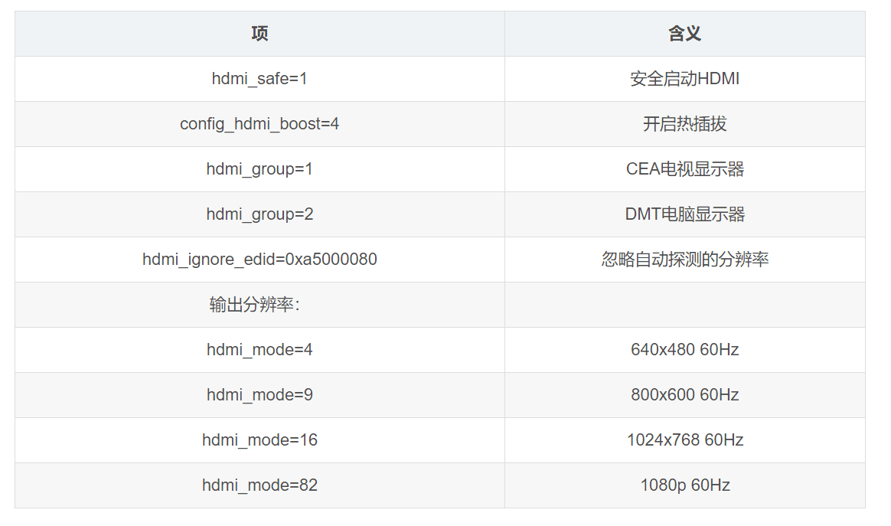
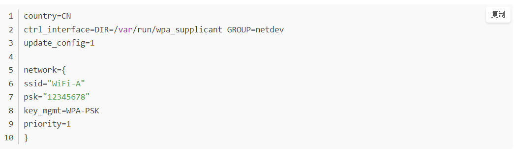

# Raspberry-remote
树莓派3b+环境搭建:https://blog.csdn.net/zhangjun62/article/details/80517176

树莓派+opencv3.4安装：https://www.jianshu.com/p/56929416b4a1

树莓派+qt5安装 ：https://blog.csdn.net/qq_43433255/article/details/84678512

树莓派+pycharm跨平台编译:https://blog.csdn.net/qq_43433255/article/details/84678512

树莓派+python3+serial模块串口应用：http://www.waveshare.net/study/article-606-1.html

树莓派+热点putty+vnc远程连接：https://blog.csdn.net/u011444756/article/details/83345595
树莓派+ptyhon+自动启动编译需要创建两个文件分别（.desktop 和.sh）：https://blog.csdn.net/weixin_41860080/article/details/87211518 +https://blog.csdn.net/pjlxm/article/details/78285735 

树莓派远程桌面显示更改，
更改boot下config.txt

用热点链接：
1.安装完系统后在该目录下新建wpa_supplicant.conf文件填入以下信息:                                                                              
country=CN
ctrl_interface=DIR=/var/run/wpa_supplicant GROUP=netdev
update_config=1
network={
ssid="WiFi-A"
psk="12345678"
key_mgmt=WPA-PSK
priority=1
}

如果刚刚安装的是最新系统不用更新固件不用执行sudo rpi-update

在安装软件是可以先更新源，如果出现依赖问题，把源换回官方的吧,如果官方下载速度不行换之前版本的系统镜像，别用最新的版本。

hdmi_mode=1    640x350   85Hz

hdmi_mode=2    640x400   85Hz

hdmi_mode=3    720x400   85Hz

hdmi_mode=4    640x480   60Hz

hdmi_mode=5    640x480   72Hz

hdmi_mode=6    640x480   75Hz

hdmi_mode=7    640x480   85Hz

hdmi_mode=8    800x600   56Hz

hdmi_mode=9    800x600   60Hz

hdmi_mode=10   800x600   72Hz

hdmi_mode=11   800x600   75Hz

hdmi_mode=12   800x600   85Hz

hdmi_mode=13   800x600   120Hz

hdmi_mode=14   848x480   60Hz

hdmi_mode=15   1024x768  43Hz  DO NOT USE

hdmi_mode=16   1024x768  60Hz

hdmi_mode=17   1024x768  70Hz

hdmi_mode=18   1024x768  75Hz

hdmi_mode=19   1024x768  85Hz

hdmi_mode=20   1024x768  120Hz

hdmi_mode=21   1152x864  75Hz

hdmi_mode=22   1280x768        reduced blanking

hdmi_mode=23   1280x768  60Hz

hdmi_mode=24   1280x768  75Hz

hdmi_mode=25   1280x768  85Hz

hdmi_mode=26   1280x768  120Hz reduced blanking

hdmi_mode=27   1280x800        reduced blanking

hdmi_mode=28   1280x800  60Hz

hdmi_mode=29   1280x800  75Hz

hdmi_mode=30   1280x800  85Hz

hdmi_mode=31   1280x800  120Hz reduced blanking

hdmi_mode=32   1280x960  60Hz

hdmi_mode=33   1280x960  85Hz

hdmi_mode=34   1280x960  120Hz reduced blanking

hdmi_mode=35   1280x1024 60Hz

hdmi_mode=36   1280x1024 75Hz

hdmi_mode=37   1280x1024 85Hz

hdmi_mode=38   1280x1024 120Hz reduced blanking

hdmi_mode=39   1360x768  60Hz

hdmi_mode=40   1360x768  120Hz reduced blanking

hdmi_mode=41   1400x1050       reduced blanking

hdmi_mode=42   1400x1050 60Hz

hdmi_mode=43   1400x1050 75Hz

hdmi_mode=44   1400x1050 85Hz

hdmi_mode=45   1400x1050 120Hz reduced blanking

hdmi_mode=46   1440x900        reduced blanking

hdmi_mode=47   1440x900  60Hz

hdmi_mode=48   1440x900  75Hz

hdmi_mode=49   1440x900  85Hz

hdmi_mode=50   1440x900  120Hz reduced blanking

hdmi_mode=51   1600x1200 60Hz

hdmi_mode=52   1600x1200 65Hz

hdmi_mode=53   1600x1200 70Hz

hdmi_mode=54   1600x1200 75Hz

hdmi_mode=55   1600x1200 85Hz

hdmi_mode=56   1600x1200 120Hz reduced blanking

hdmi_mode=57   1680x1050       reduced blanking

hdmi_mode=58   1680x1050 60Hz

hdmi_mode=59   1680x1050 75Hz

hdmi_mode=60   1680x1050 85Hz

hdmi_mode=61   1680x1050 120Hz reduced blanking

hdmi_mode=62   1792x1344 60Hz

hdmi_mode=63   1792x1344 75Hz

hdmi_mode=64   1792x1344 120Hz reduced blanking

hdmi_mode=65   1856x1392 60Hz

hdmi_mode=66   1856x1392 75Hz

hdmi_mode=67   1856x1392 120Hz reduced blanking

hdmi_mode=68   1920x1200       reduced blanking

hdmi_mode=69   1920x1200 60Hz

hdmi_mode=70   1920x1200 75Hz

hdmi_mode=71   1920x1200 85Hz

hdmi_mode=72   1920x1200 120Hz reduced blanking

hdmi_mode=73   1920x1440 60Hz

hdmi_mode=74   1920x1440 75Hz

hdmi_mode=75   1920x1440 120Hz reduced blanking

hdmi_mode=76   2560x1600       reduced blanking

hdmi_mode=77   2560x1600 60Hz

hdmi_mode=78   2560x1600 75Hz

hdmi_mode=79   2560x1600 85Hz

hdmi_mode=80   2560x1600 120Hz reduced blanking

hdmi_mode=81   1366x768  60Hz

hdmi_mode=82   1080p     60Hz

hdmi_mode=83   1600x900        reduced blanking

hdmi_mode=84   2048x1152       reduced blanking

hdmi_mode=85   720p      60Hz

hdmi_mode=86   1366x768        reduced blanking

opencv代码优化注意for循环和计算方式，可以多线程

相关资料：链接：https://pan.baidu.com/s/1CoXNJqjHTD7Qv15bZ1sYOA 

提取码：scn5 

资料文件win32下有我的镜像已经安装好QT和opencv:
![avatar]3.png
